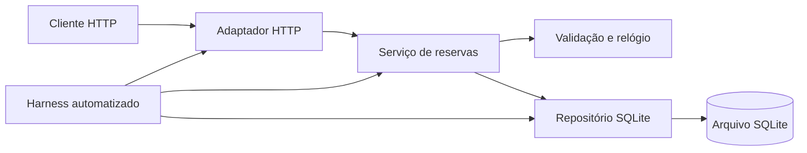

# Arquitetura e decisões

O ReservaLab separa as regras de negócio da comunicação HTTP e da persistência. Isso permite testar conflitos e datas com um relógio fixo e verificar os contratos da API usando um servidor local e bancos temporários.

As decisões abaixo foram propostas durante a preparação assistida por IA. A aprovação humana deve ser registrada no PR. Alterações posteriores devem atualizar a decisão afetada e a especificação correspondente.

## ADR-001 — Python e biblioteca padrão

**Contexto:** a entrega precisa de uma aplicação pequena e de testes fáceis de reproduzir.

**Decisão:** aceitar Python 3.12 ou superior, padronizar Python 3.13 no contêiner e usar servidor HTTP da biblioteca padrão, `sqlite3` e `unittest`, sem dependências Python externas. O runtime local inicialmente disponível é Python 3.12.14.

**Consequências:** instalação curta e execução offline da suíte após obter o runtime. O servidor serve para demonstração local; autenticação, exposição pública e operação em produção exigem outra avaliação. Não há interface gráfica no escopo.

## ADR-002 — SQLite e transação única para reservas

**Contexto:** verificar o horário livre e inserir em operações separadas permitiria que duas requisições aprovassem a mesma vaga.

**Decisão:** persistir em SQLite e executar a consulta de conflito e a inserção dentro de uma mesma transação `BEGIN IMMEDIATE`. Cada operação deve usar conexão apropriada ao seu ciclo de vida, sem compartilhar uma conexão de forma insegura entre requisições.

**Consequências:** a escrita serializada garante o invariante no processo de reserva. A opção é adequada ao exercício, com poucos usuários e um banco local; não constitui arquitetura distribuída.

## ADR-003 — UTC e intervalos semiabertos

**Contexto:** textos com fusos distintos podem representar o mesmo instante; períodos adjacentes não devem bloquear um ao outro.

**Decisão:** exigir fuso explícito, validar instantes de minuto inteiro, armazenar/comparar em UTC e retornar UTC com `Z`. Definir horários como `[início, fim)`.

**Consequências:** comparação determinística e adjacência permitida. O cliente é responsável por converter para o horário local de exibição. Segundos diferentes de zero são rejeitados para evitar ambiguidade na duração.

## ADR-004 — Cancelamento preserva o registro

**Contexto:** apagar a reserva tornaria a consulta e a repetição de pedidos menos previsíveis.

**Decisão:** mudar `active` para `cancelled`, preservando o registro. Repetir o cancelamento retorna o registro cancelado e status 200.

**Consequências:** a listagem mostra o histórico simples e o horário fica livre. Esta entrega não mantém trilha completa de auditoria nem identifica quem cancelou.

## ADR-005 — Relógio e banco substituíveis nos testes

**Contexto:** testes com o relógio real ou banco compartilhado podem falhar apenas pela passagem do tempo ou pela ordem de execução.

**Decisão:** permitir injeção de relógio e uso de arquivos SQLite temporários isolados. Testar tanto as regras diretamente quanto requisições HTTP reais contra servidor de teste.

**Consequências:** cenários de passado, igualdade e concorrência podem ser reproduzidos. O teste do adaptador não substitui o teste das regras nem o inverso.

## ADR-006 — Entrega por PR e evidência autêntica

**Contexto:** a atividade avalia colaboração, revisão e validação, além do código.

**Decisão:** usar `main`, `develop` e `feature/*`; integrar por PR revisado por outro integrante. Registrar tarefas em Issues com um responsável humano e um revisor. O uso de IA é identificado, sem atribuir a agentes a identidade de colegas.

**Consequências:** decisões e comentários ficam rastreáveis. Aprovações, merges e submissões dependem dos integrantes. A disponibilidade de proteção de branch deve ser conferida nas configurações do repositório, e não presumida pela existência deste documento.
